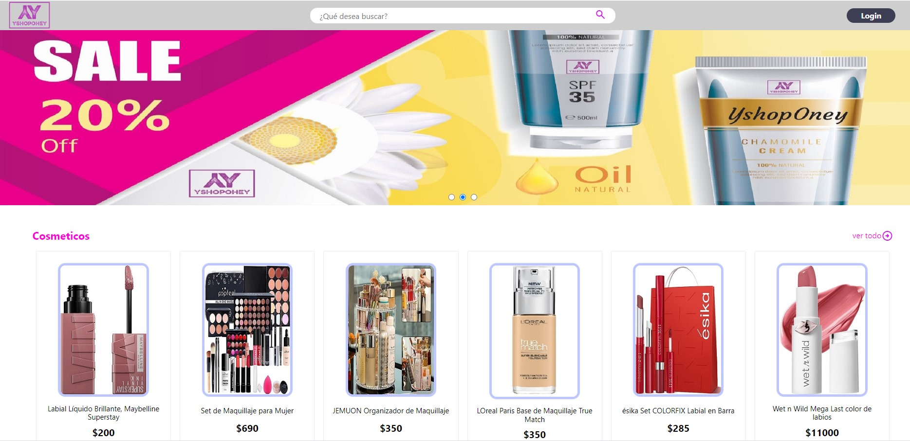

# Front End
# Challenge ONE | - YshopOney Geek

     "Challenge ONE - YshopOney"

        

"YshopOney E-commerce"

El proyecto es una e-commerce desarrollado con HTML, CSS, JavaScript y Node.js.

*** Instrucciones y detalles del Proyecto ***

-- Requisitos previos para la correcta visualización --

Node.js instalado en el equipo

Para acceder a la sección de editar:
admin@yshoponey.com
pass: ******** (Son asteriscos)

Nota:
Las funcionalidades podrian estar limitadas.
